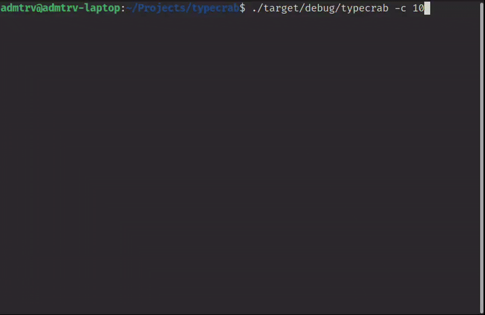
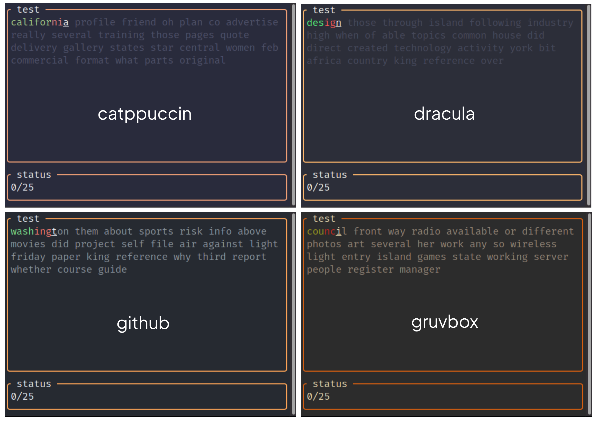

<p align="center">
  
</p>

# Introduction  

Our project is a lightweight and customizable typing test, inspired by [Monkeytype](https://monkeytype.com/). It is implemented in Rust and features both a **command-line interface (CLI)** and a **web-based user interface (Web UI)**. Users can practice typing in different modes, track performance statistics, and improve their typing speed.

# Motivation 

The main motivation behind this project is that most existing typing tests often focus either on visual effects and gamification or, conversely, on a minimalistic interface without flexibility. This leads to some tools being too heavy and overloaded with unnecessary features, while others are limited in customization and use. In addition, most popular solutions are written in high-level languages, which affects their performance. Our project is aimed at creating a fast, cross-platform typing test with minimalistic design, support for custom settings and allowing users to practice typing both **while casually browsing the web** and **while coding in the terminal** during breaks or context switches.

# Terminal UI

<p align="center">
  
</p>

## Usage

```
~$ typecrab -h
A minimalistic, customizable typing test.

Usage: typecrab [OPTIONS]

Options:
      --list-languages        List available languages
      --list-schemes          List available color schemes
  -w, --words                 Enable words mode [default]
  -q, --quote                 Enable quote mode
  -z, --zen                   Enable zen mode
  -p, --punctuation           Include punctuation in test text
  -n, --numbers               Include numbers in test text
      --strict                Disable backtracking of completed words
      --death                 Enable sudden death on first mistake
  -l, --language <lang>       Specify test language [default: en]
      --language-file <path>  Specify custom test file
  -s, --scheme <lang>         Specify color scheme [default: monokai]
      --scheme-file <path>    Specify custom color scheme file
  -c, --count <n>             Specify word count [default: 25]
  -t, --time <sec>            Specify time limit
  -h, --help                  Print help
  -V, --version               Print version
```

Examples:

```
typecrab -c 10 -l sk                  # 10-word test in slovak language
typecrab -q -l code-cpp -s gruvbox    # quote mode with c++ quotes and gruvbox color scheme
typecrab -w -p -t 45 --strict         # words mode with punctuation, 45-second timer and strict mode enabled
```

## Color Schemes

In addition to the standard **Monokai Pro** scheme which is shown above, other schemes are implemented:

<p align="center">
  
</p>

# Architecture

This project follows a modular design, separating core logic from user interfaces. The core module contains all shared logic and exposes a **core public API (Core API)**. Both the CLI and Web UI are fully independent components that interact only with the core, not with each other.

```
┌───────────┐                           ┌───────────┐                                                     
│    cli    │                           │    web    │                                                     
├───────────┴───────────────┐           ├───────────┴────────────────┐                                    
│                           │           │                            │                                    
│       ┌───────────┐       │           │       ┌────────────┐       │                                    
│       │           │       │           │       │            │       │                                    
│       │    CLI    │       │           │       │   Web UI   │       │                                    
│       │           │       │           │       │            │       │                                    
│       └─────┬─────┘       │           │       └──────┬─────┘       │                                    
│             │             │           │              │             │                                    
└─────────────┼─────────────┘           └──────────────┼─────────────┘                                    
              │                                        │                                                  
             uses                                    uses                                                 
              │                                        │                                                  
              │    ┌────────────┐                      │                                                  
              │    │    core    │                      │                                                  
              │    ├────────────┴─────────────────┐    │                                                  
              │    │                              │    │                                                  
              │    │       ┌──────────────┐       │    │                                                  
              │    │       │              │       │    │                                                  
              └────┼──────►│   Core API   │◄──────┼────┘                                                  
                   │       │              │       │                                                       
                   │       └──────────────┘       │                                                       
                   │                              │                                                       
                   └──────────────────────────────┘                                                       
```

# Structure

This modular approach results in the following project layout:

- `core/` - shared logic and interfaces backend
- `cli/` - command-line interface
- `web/` - browser-based interface
- `resources/` - build-in content:
    - `words/` - language-specific word lists
    - `quotes/` - language-specific quotes
    - `schemes/` - color CSS schemes